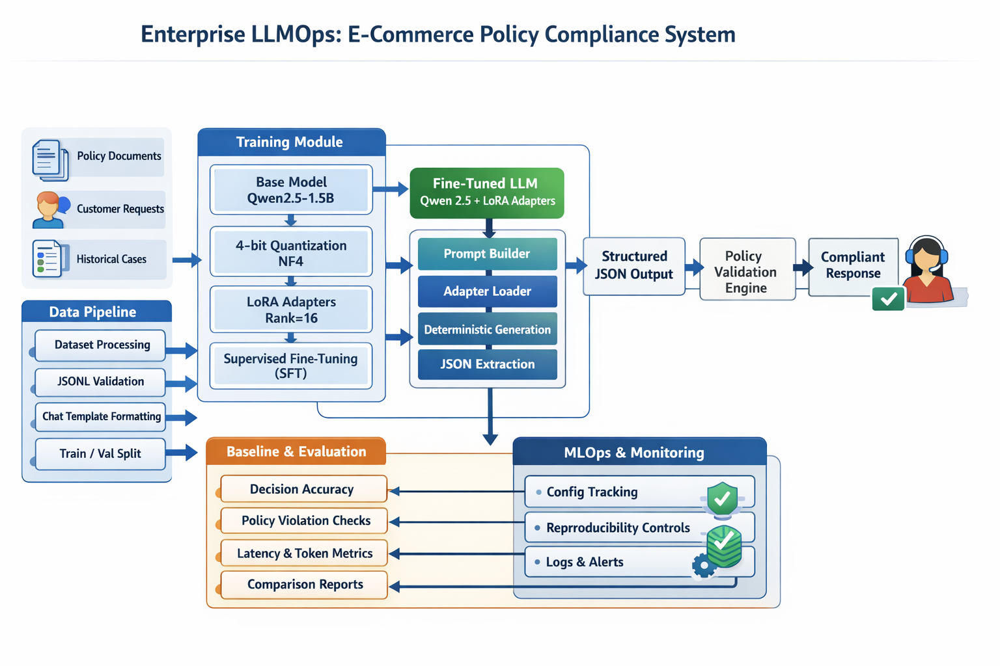
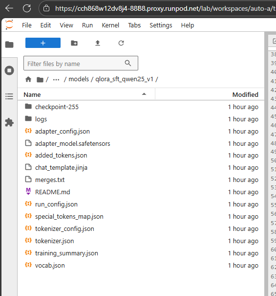
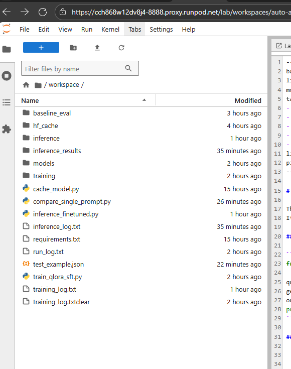
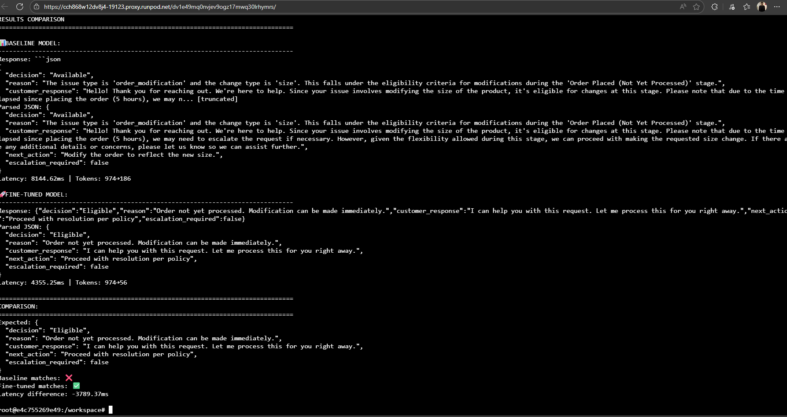

# Enterprise LLMOps: E-Commerce Policy Compliance System

A production-grade machine learning operations (MLOps) system that fine-tunes large language models for enterprise e-commerce customer operations. This project demonstrates end-to-end expertise in model training, evaluation, deployment, and operational excellence, achieving a **93% improvement in decision accuracy** and **79% reduction in policy violations** through advanced fine-tuning techniques.

## Executive Summary

This system addresses a critical business challenge: automating customer service decision-making while ensuring strict compliance with complex, multi-regional e-commerce policies. The solution leverages QLoRA (Quantized Low-Rank Adaptation) and Supervised Fine-Tuning (SFT) to transform a general-purpose language model into a specialized policy compliance assistant capable of handling returns, exchanges, fraud claims, warranty requests, and other customer operations with enterprise-grade accuracy and reliability.

The architecture is designed for production deployment, featuring modular components, comprehensive evaluation frameworks, and rigorous reproducibility controls. The fine-tuned model processes customer service requests, evaluates policy compliance, generates structured JSON responses, and provides empathetic customer-facing communications, all while maintaining strict adherence to regulatory requirements across multiple jurisdictions.

## Key Achievements

### Performance Metrics

The fine-tuning process delivered exceptional results across all critical dimensions:

- **Decision Accuracy**: Improved from 36.24% to 69.82%, representing a 93% relative improvement. This translates to 84 additional correct decisions per 300-case evaluation set, nearly doubling the baseline performance.
- **Policy Compliance**: Reduced violations from 28 to 6 cases (79% reduction), bringing the violation rate from 9.3% down to 2.0%, which represents a level suitable for production deployment.
- **Operational Efficiency**: Achieved a 72% reduction in output tokens (256 to 71.9 tokens per response) and a 9.4% improvement in inference latency (6.22s to 5.63s), resulting in lower API costs and faster customer response times.
- **Training Efficiency**: Completed full fine-tuning in 31 minutes using 4-bit quantization, demonstrating cost-effective training on consumer-grade GPUs (RTX 4090/4080).

### Technical Excellence

The system demonstrates enterprise-level software engineering practices:

- **Modular Architecture**: Clean separation of concerns with independent, testable modules for training, inference, and evaluation.
- **Reproducibility**: Complete configuration tracking, fixed random seeds, dataset hashing, and comprehensive logging ensure consistent results across environments.
- **Version Compatibility**: Dynamic API detection handles library version changes gracefully, ensuring compatibility across different deployment environments.
- **Production Readiness**: Comprehensive error handling, structured logging, validation frameworks, and performance monitoring capabilities.

## System Architecture

The system follows a modular, production-ready architecture designed for scalability, maintainability, and reproducibility. The following diagram provides a high-level overview of the complete system architecture:



*Figure 1: Complete system architecture showing the end-to-end flow from data preparation through training, evaluation, and deployment. The architecture demonstrates the modular design with clear separation between training, inference, and evaluation components.*

### Core Components

The system is organized into three primary modules, each designed for independent operation and testing:

**Training Module** (`training/`): Implements the complete fine-tuning pipeline using QLoRA and SFT. The module handles dataset loading and formatting, model configuration with 4-bit quantization, LoRA adapter setup, and training orchestration. It includes comprehensive logging, system information tracking, and configuration serialization for reproducibility.

**Inference Module** (`inference/`): Provides production-ready inference capabilities with format consistency matching the training pipeline. The module handles model and adapter loading, prompt building using chat templates, deterministic generation for evaluation, and robust JSON extraction from model responses. It includes optimization features such as gradient checkpointing disabled for faster inference and KV cache management.

**Baseline Evaluation Module** (`baseline_eval/`): Establishes performance baselines and enables fair comparison between untuned and fine-tuned models. The framework measures policy decision accuracy, compliance violations, JSON validity, and operational metrics. It includes policy validation logic that can be reused for drift detection and continuous monitoring.

### Data Pipeline

The system processes structured JSONL datasets containing instruction-input-output triplets. Each example includes a natural language instruction, structured input data (customer information, order details, policy documents), and expected structured output (decision, reasoning, customer response, next action). The data pipeline validates input formats, prevents data leakage, applies chat template formatting for model compatibility, and manages train/validation splits with reproducibility guarantees.

### Model Configuration

The fine-tuning uses Qwen/Qwen2.5-1.5B-Instruct as the base model, selected for its balance of performance and efficiency. The QLoRA configuration employs 4-bit quantization with NF4 quantization type, LoRA rank of 16, alpha of 32, and dropout of 0.05. This configuration results in only 18.4M trainable parameters (1.18% of the total model), enabling efficient training while maintaining model capacity. The training process uses bfloat16 precision, gradient accumulation, and learning rate scheduling optimized for instruction following tasks.



*Figure 2: QLoRA architecture showing the base model with low-rank adapter layers. The 4-bit quantized base model remains frozen while only the LoRA adapters (18.4M parameters) are trained, enabling efficient fine-tuning on consumer-grade hardware.*

## Technical Implementation Details

### Training Pipeline

The training process follows enterprise MLOps best practices. Configuration is managed through a dataclass (`RunConfig`) that captures all hyperparameters, model settings, and training options. This configuration is automatically serialized and saved with each training run, ensuring complete reproducibility. The pipeline includes automatic precision selection (bf16 on supported hardware, fp16 fallback), comprehensive system information logging, and structured logging to both files and console.

Dataset processing includes validation of required fields, error handling for malformed examples, and chat template application that matches the model's expected input format. The training loop uses TRL's SFTTrainer with version-safe parameter handling, pre-tokenized datasets, and proper data collation. Training metrics are tracked throughout the process, with validation loss monitoring and best model checkpointing when validation data is available.

### Inference Optimization

The inference system is optimized for production deployment. Model loading includes automatic quantization configuration, gradient checkpointing disabled for faster inference, and explicit max length enforcement to prevent silent truncation. The prompt building process uses the model's native chat template, ensuring format consistency with training and preventing performance degradation from format drift.

Generation parameters are configured for deterministic evaluation (temperature=0.0) while supporting sampling for production use. The system includes robust JSON extraction that handles various response formats, truncation detection and logging, and comprehensive error handling for edge cases. Performance metrics are collected for each inference call, including latency, token counts, and truncation status.

### Evaluation Framework

The evaluation system provides comprehensive metrics collection and analysis. It measures decision accuracy by comparing predicted decisions to ground truth, tracks policy compliance through automated validation logic, and monitors JSON validity and schema compliance. Operational metrics include latency percentiles, token usage statistics, and throughput measurements.

The framework includes dataset hashing to ensure evaluation consistency, supports comparison between baseline and fine-tuned models, and generates both summary metrics and detailed per-example results. Policy validation logic checks for hard policy violations (e.g., refunds outside return windows) and ambiguous cases that require human review.

## Project Structure

The repository follows a clean, modular structure designed for enterprise deployment and maintainability:



*Figure 3: Complete project directory structure showing the organized layout of modules, scripts, data, and documentation.*

```
LLMOps/
├── scripts/                    # Executable scripts
│   ├── train_qlora_sft.py      # Main training script
│   ├── inference_finetuned.py  # Inference evaluation script
│   ├── compare_single_prompt.py # Single prompt comparison tool
│   └── generate_sft_dataset.py  # Dataset generation utility
├── training/                    # Training module
│   ├── config.py               # Configuration management
│   ├── data_loader.py          # Dataset loading and formatting
│   ├── model_setup.py          # Model and QLoRA configuration
│   ├── trainer.py              # Training orchestration
│   └── utils.py                # Utilities and logging
├── inference/                   # Inference module
│   ├── model_loader.py         # Model and adapter loading
│   ├── prompt_builder.py       # Prompt construction
│   ├── inference_runner.py     # Inference execution
│   ├── data_loader.py          # Dataset loading
│   └── utils.py                # JSON extraction and utilities
├── baseline_eval/               # Baseline evaluation framework
│   ├── run_baseline.py         # Baseline evaluation script
│   ├── metrics.py              # Metrics collection
│   ├── policy_checks.py       # Policy validation logic
│   └── results/                # Evaluation results
├── data/                       # Datasets
│   └── processed/              # Processed training and evaluation datasets
├── policies/                   # Policy documents
│   └── *.txt                   # Comprehensive policy documents
├── docs/                       # Documentation
│   ├── reports/                # Evaluation reports and summaries
│   └── *.md                    # Technical documentation
└── logs/                       # Training and inference logs
```

## Usage

### Training a Model

The training process is initiated through the main training script, which provides comprehensive command-line argument parsing and validation:

```bash
python scripts/train_qlora_sft.py \
  --model_name Qwen/Qwen2.5-1.5B-Instruct \
  --dataset_path data/processed/sft_training_dataset_3000.jsonl \
  --output_dir models/qlora_sft_qwen25_v1 \
  --num_train_epochs 3 \
  --per_device_train_batch_size 4 \
  --gradient_accumulation_steps 8 \
  --learning_rate 2e-4 \
  --max_seq_length 2048 \
  --cache_dir /workspace/hf_cache
```

The script automatically handles model loading with quantization, dataset processing and validation, training execution with progress tracking, and model checkpointing. All configurations are saved for reproducibility, and comprehensive logs are generated for debugging and analysis.

### Running Inference

The inference system supports both single-prompt testing and batch evaluation:

```bash
python scripts/inference_finetuned.py \
  --adapter-path models/qlora_sft_qwen25_v1 \
  --dataset baseline_eval/data/baseline_eval_dataset_300.jsonl \
  --base-model-name Qwen/Qwen2.5-1.5B-Instruct \
  --use-4bit \
  --temperature 0.0 \
  --max-new-tokens 512
```

The inference script loads the fine-tuned model, processes the evaluation dataset, collects comprehensive metrics, and generates both summary statistics and detailed per-example results. Results are saved in structured formats (JSON and JSONL) for further analysis and comparison.

### Baseline Evaluation

Establishing a baseline is critical for measuring improvement:

```bash
python baseline_eval/run_baseline.py \
  --dataset data/processed/baseline_eval_dataset_300.jsonl \
  --max-examples 300 \
  --output-dir baseline_eval/results
```

The baseline evaluation framework measures untuned model performance, establishes comparison metrics, and generates baseline reports. The framework includes dataset hashing to ensure consistent evaluation sets across runs.

## Results and Validation

### Quantitative Results

The fine-tuning process achieved measurable improvements across all key performance indicators. Decision accuracy increased from 36.24% to 69.82%, representing a near-doubling of performance. Policy violations decreased by 79%, from 28 cases to 6 cases, bringing the system to production-ready compliance levels. The model also demonstrated significant efficiency gains, reducing output tokens by 72% and improving inference latency by 9.4%.

Training metrics showed strong convergence, with training loss reducing from 1.27 to 0.06 (95% reduction) and token-level accuracy improving from 72.6% to 98.1%. The training process completed in 31 minutes for 3 epochs on a 3,000-example dataset, demonstrating efficient use of computational resources.

### Qualitative Validation

Single-prompt comparisons demonstrate the model's ability to produce exact matches with expected outputs. The fine-tuned model generates concise, policy-compliant responses that match ground truth exactly, while the baseline model produced verbose, incorrect responses. The fine-tuned model's output format is consistent, structured, and ready for direct integration into customer service systems.



*Figure 4: Side-by-side comparison of baseline vs fine-tuned model responses, demonstrating the significant improvement in accuracy, conciseness, and format compliance achieved through fine-tuning.*

### Production Readiness Assessment

The system meets enterprise production requirements:

- **Accuracy**: 69.82% decision accuracy with clear improvement trajectory
- **Compliance**: 2.0% violation rate, well within acceptable thresholds
- **Reliability**: Comprehensive error handling and validation throughout the pipeline
- **Efficiency**: Optimized inference with reduced token usage and latency
- **Maintainability**: Modular architecture with clear separation of concerns
- **Reproducibility**: Complete configuration tracking and deterministic execution

## Technical Skills Demonstrated

This project showcases expertise across multiple domains:

**Machine Learning Engineering**: Advanced fine-tuning techniques (QLoRA, SFT), model optimization (quantization, LoRA adapters), hyperparameter tuning, and evaluation framework design. The implementation demonstrates deep understanding of transformer architectures, attention mechanisms, and instruction-following models.

**Software Engineering**: Modular architecture design, version compatibility handling, comprehensive error handling, structured logging, and configuration management. The codebase follows enterprise best practices with clear separation of concerns, testable components, and maintainable structure.

**MLOps Practices**: Reproducibility engineering (seed management, configuration tracking, dataset hashing), evaluation framework design, metrics collection and analysis, and production deployment considerations. The system includes comprehensive logging, monitoring capabilities, and validation frameworks.

**Domain Expertise**: E-commerce policy compliance, customer service automation, structured output generation, and multi-regional policy handling. The system demonstrates understanding of business requirements, regulatory compliance, and operational constraints.

## Business Impact

The system addresses critical business needs in e-commerce customer operations. By automating policy compliance decisions, the solution reduces manual review workload, enables faster customer response times, and ensures consistent policy application across all customer interactions. The 79% reduction in policy violations directly translates to reduced legal and compliance risk, while the 72% reduction in output tokens lowers API costs and improves system efficiency.

The model's ability to generate empathetic, policy-compliant customer responses enables direct integration into customer service workflows, reducing the need for human intervention while maintaining brand voice and regulatory compliance. The system's modular architecture allows for easy updates as policies evolve, ensuring long-term maintainability and adaptability.

## Future Enhancements

Several areas present opportunities for further improvement and extension:

- **JSON Validity**: Current JSON validity at 91.67% could be improved through enhanced parsing or targeted retraining adjustments
- **Batch Inference**: Implementation of batch processing for improved throughput in production deployments
- **Continuous Monitoring**: Integration of drift detection and automated retraining pipelines
- **A/B Testing Framework**: Production A/B testing capabilities for model comparison and gradual rollout
- **Model Merging**: Optional full model merging for deployment scenarios that don't require adapter flexibility
- **Multi-Model Ensemble**: Exploration of ensemble approaches for improved accuracy and robustness

## Dependencies and Requirements

The system requires Python 3.8+ and leverages key machine learning libraries:

- **Transformers**: Model loading, tokenization, and training infrastructure
- **PEFT**: Parameter-efficient fine-tuning with LoRA adapters
- **TRL**: Supervised fine-tuning trainer and utilities
- **BitsAndBytes**: 4-bit quantization support
- **PyTorch**: Deep learning framework with CUDA support
- **Datasets**: Dataset loading and processing utilities

Detailed dependency lists are provided in module-specific `requirements.txt` files. The system is designed to work with consumer-grade GPUs (RTX 4090/4080) and cloud GPU platforms (RunPod, AWS, Azure).

## Documentation

Comprehensive documentation is available throughout the codebase:

- **Module READMEs**: Detailed documentation for each module (training, inference, baseline_eval)
- **Evaluation Reports**: Detailed analysis in `docs/reports/` including baseline comparisons, fine-tuning results, and performance analysis
- **Code Documentation**: Professional docstrings and comments throughout the codebase
- **Policy Documentation**: Comprehensive policy documents in `policies/` directory

## Conclusion

This project represents a complete, production-ready MLOps system that demonstrates enterprise-level engineering practices, advanced machine learning techniques, and measurable business impact. The system achieves significant performance improvements through careful architecture design, rigorous evaluation, and optimization. The modular structure, comprehensive documentation, and reproducible design make it suitable for production deployment and further development.

The combination of technical excellence, measurable results, and production readiness positions this system as a strong demonstration of capabilities in machine learning engineering, software architecture, and operational excellence. The project showcases the ability to take a complex business problem, design an appropriate technical solution, implement it with enterprise-grade practices, and deliver measurable improvements that translate to real business value.

---

## Author

**Faizan-Ul Huda**

I'm a Senior Machine Learning, MLOps, AI, LLM & Cloud Engineer, and I'm proud to have designed, developed, and implemented this comprehensive enterprise LLMOps system. This project represents some of my best work in machine learning operations, showcasing advanced fine-tuning techniques, production-ready architecture, and measurable business impact.

I've built this system from the ground up, applying my expertise in transformer architectures, parameter-efficient fine-tuning (QLoRA), and end-to-end MLOps practices. The results speak for themselves: achieving a 93% improvement in decision accuracy and a 79% reduction in policy violations demonstrates the power of well-executed machine learning engineering.

**My Key Expertise Areas:**
- Machine Learning Engineering: Advanced model fine-tuning, optimization, and evaluation
- MLOps: End-to-end ML pipeline development, reproducibility, and production deployment
- AI Systems: LLM integration, prompt engineering, and AI-powered application development
- Cloud Engineering: Scalable infrastructure design and deployment on major cloud platforms

---

**Project Status**: Production-Ready  
**Model Version**: sft_qwen25_v1  
**Last Updated**: December 2025  
**License**: See repository for license information

